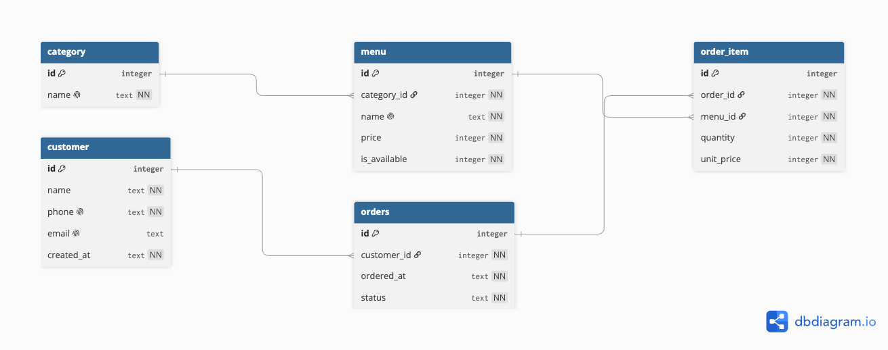

# Codyssey B5-1. SQL로 만드는 나만의 데이터베이스

## 1. 프로젝트 소개

SQLite를 사용하여 카페 주문 시스템을 모델링한 데이터베이스 실습 프로젝트입니다.
고객, 카테고리, 메뉴, 주문, 주문 상세 테이블을 설계하고 PK/FK 관계, 제약 조건, 샘플 데이터, 기본 조회, 조인, 집계, 서브쿼리, 수정/삭제 쿼리를 작성했습니다.

## 2. 사용 기술

| 기술 및 도구 | 역할 |
| --- | --- |
| SQL | 테이블 생성, 데이터 입력, 조회, 수정, 삭제 쿼리 작성 |
| SQLite | 파일 기반 관계형 데이터베이스 |
| SQLite CLI | SQL 스크립트 실행 및 파일 결과 저장 (터미널 실행 도구) |
| DBeaver | 데이터베이스 연결 및 쿼리 실행 (GUI DB 도구) |
| dbdiagram.io | ERD 작성 |
| Git / GitHub | 버전 관리 및 저장소 관리 |

DBeaver는 SQLite 데이터베이스 파일을 연결하여 테이블 구조, 데이터, 관계를 시각적으로 확인하는 데 사용했습니다.  
SQLite CLI는 작성한 SQL 스크립트를 터미널에서 실행하고, 쿼리 실행 결과를 텍스트 파일로 저장하는 데 사용했습니다.

## 3. 데이터 모델

| 테이블 | 역할 | 설명 |
| --- | --- | --- | 
| `customer` | 고객 정보 | 한 명의 고객이 여러 주문을 할 수 있으므로 `orders.customer_id`가 `customer.id`를 참조 |
| `category` | 메뉴 카테고리 | 하나의 카테고리에는 여러 메뉴가 속할 수 있으므로 `menu.category_id`가 `category.id`를 참조|
| `menu` | 판매 메뉴 정보 | 카테고리, 가격, 판매 가능 여부 정보를 가짐 |
| `orders` | 주문 정보 | 주문 고객, 주문 시각, 주문 상태를 관리 |
| `order_item` | 주문 상세, 주문에 포함된 메뉴 목록 | 하나의 주문에는 여러 메뉴가 들어갈 수 있으므로 `orders`와 `menu` 사이를 연결 |

## 4. 테이블 관계

```
customer 1 : N orders
orders 1 : N order_item
menu 1 : N order_item
category 1 : N menu
```

| 관계 | 설명 |
| --- | --- |
| `customer.id -> orders.customer_id` | 고객 1명은 여러 주문을 할 수 있다 |
| `orders.id -> order_item.order_id` | 주문 1건은 여러 메뉴를 포함할 수 있다 |
| `menu.id -> order_item.menu_id` | 메뉴 1개는 여러 주문 상세에 포함될 수 있다 |
| `category.id -> menu.category_id` | 카테고리 1개는 여러 메뉴를 가진다 |

## 5. 파일 구조
```text
.
├── 01_schema.sql
├── 02_insert_data.sql
├── 03_queries.sql
├── 04_queries_for_result.sql
├── 05_bonus_queries.sql
├── 06_bonus_queries_for_result.sql
├── cafe_order.db
├── docs
│   └── erd.png
├── README.md
└── results
    ├── bonus_query_result.txt
    └── query_result.txt
```

## 6. 파일 설명

| 파일 | 설명 |
| --- | --- |
| `01_schema.sql` | 테이블 생성 및 제약 조건 정의 |
| `02_insert_data.sql` | 샘플 데이터 입력 |
| `03_queries.sql` | 기본 조회, 조인, 집계, 서브쿼리, 수정 및 삭제 쿼리 |
| `04_queries_for_result.sql` | 기본 쿼리 결과 저장을 위한 출력용 SQL 스크립트 |
| `05_bonus_queries.sql` | 보너스 쿼리 |
| `06_bonus_queries_for_result.sql` | 보너스 쿼리 결과 저장을 위한 출력용 SQL 스크립트 |
| `cafe_order.db` | SQLite 데이터베이스 파일 |
| `docs/erd.png` | ERD 이미지 |
| `results/query_result.txt` | 기본 쿼리 실행 결과 |
| `results/bonus_query_result.txt` | 보너스 쿼리 실행 결과 |

## 7. 실행 방법

### SQLite CLI 실행
SQLite CLI는 터미널에서 `sqlite3` 명령어로 실행하는 방식입니다.

이 프로젝트는 SQLite 데이터베이스를 사용합니다.
터미널에서 프로젝트 루트 디렉토리로 이동한 뒤 아래 명령어를 순서대로 실행합니다.

#### 1. 데이터베이스 스키마 생성
`01_schema.sql` 파일을 실행해서 테이블을 생성

```
sqlite3 cafe_order.db < 01_schema.sql
```

#### 2. 샘플 데이터 입력
`02_insert_data.sql` 파일을 실행해서 샘플 데이터를 입력

```
sqlite3 cafe_order.db < 02_insert_data.sql
```

#### 3. 기본 쿼리 실행
`03_queries.sql` 파일을 실행해서 기본 조회, 조인, 집계, 서브쿼리, 수정 및 삭제 쿼리를 실행

```
sqlite3 cafe_order.db < 03_queries.sql
```

#### 4. 기본 쿼리 결과 파일 저장
`04_queries_for_result.sql` 파일을 실행해서 기본 쿼리 결과를 텍스트 파일로 저장

```
sqlite3 cafe_order.db < 04_queries_for_result.sql > results/query_result.txt
```

#### 5. 보너스 쿼리 실행
`05_bonus_queries.sql` 파일을 실행해서 보너스 쿼리 실행

```
sqlite3 cafe_order.db < 05_bonus_queries.sql
```

#### 6. 보너스 쿼리 결과 파일 저장
`06_bonus_queries_for_result.sql` 파일을 실행해서 보너스 쿼리 결과를 텍스트 파일로 저장

```
sqlite3 cafe_order.db < 06_bonus_queries_for_result.sql > results/bonus_query_result.txt
```

### DBeaver 실행
DBeaver를 사용하면 SQLite 데이터베이스 파일을 연결한 뒤 SQL 파일을 직접 열어 실행할 수 있습니다.

#### 1. SQLite 데이터베이스 연결

1. DBeaver를 실행합니다.
2. `Database` → `New Database Connection`을 선택합니다.
3. 데이터베이스 종류에서 `SQLite`를 선택합니다.
4. `Database File`에 프로젝트의 `cafe_order.db` 파일을 지정합니다.
5. 연결을 완료합니다.

#### 2. SQL 파일 열기

1. DBeaver에서 연결한 `cafe_order.db`를 선택합니다.
2. `SQL Editor` → `Open SQL Script` 또는 `New SQL Script`를 선택합니다.
3. 실행할 SQL 파일 내용을 열거나 붙여넣습니다.

#### 3. SQL 실행

SQL 파일 전체를 실행하려면 스크립트 실행 기능을 사용합니다.

```text
macOS: Option + X
Windows: Alt + X
```

특정 쿼리만 실행하려면 실행할 SQL 문에 커서를 두고 실행합니다.

```text
macOS: Command + Enter
Windows: Ctrl + Enter
```

#### 4. 실행 순서

처음 데이터베이스를 구성할 때는 아래 순서대로 실행합니다.

```text
01_schema.sql
02_insert_data.sql
03_queries.sql
05_bonus_queries.sql
```

결과 저장용 파일인 `04_queries_for_result.sql`, `06_bonus_queries_for_result.sql`은 SQLite CLI에서 텍스트 결과 파일을 생성하기 위한 용도로 사용했습니다.

### 쿼리 결과

쿼리 실행 결과는 `results/` 디렉토리에 저장했습니다.

| 파일 | 설명 |
| --- | --- |
| `results/query_result.txt` | 기본 쿼리 실행 결과 |
| `results/bonus_query_result.txt` | 보너스 쿼리 실행 결과 |